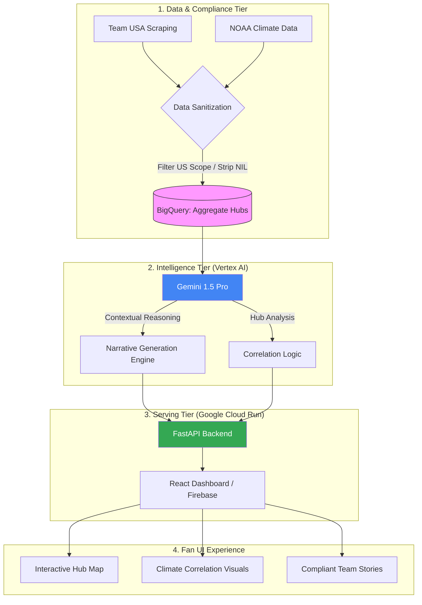

```mermaid
graph TD
    subgraph "1. Data & Compliance Tier"
        A1[Team USA Scraping] --> B1{Data Sanitization}
        A2[NOAA Climate Data] --> B1
        B1 -->|Filter US Scope / Strip NIL| C1[(BigQuery: Aggregate Hubs)]
    end

    subgraph "2. Intelligence Tier (Vertex AI)"
        C1 --> D1[Gemini 1.5 Pro]
        D1 -->|Contextual Reasoning| E1[Narrative Generation Engine]
        D1 -->|Hub Analysis| E2[Correlation Logic]
    end

    subgraph "3. Serving Tier (Google Cloud Run)"
        E1 & E2 --> F1[FastAPI Backend]
        F1 --> G1[React Dashboard / Firebase]
    end

    subgraph "4. Fan UI Experience"
        G1 --> H1[Interactive Hub Map]
        G1 --> H2[Climate Correlation Visuals]
        G1 --> H3[Compliant Team Stories]
    end

    style C1 fill:#f9f,stroke:#333
    style D1 fill:#4285F4,color:#fff
    style F1 fill:#34A853,color:#fff
```