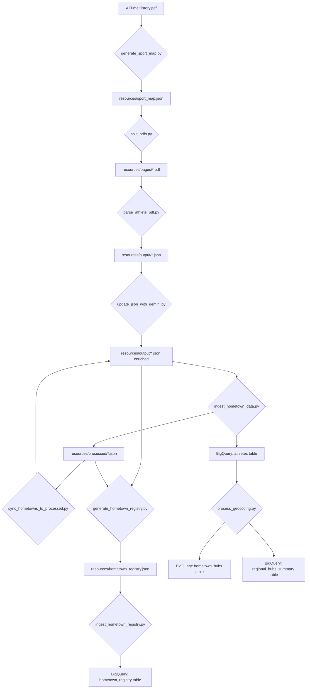

<!--
  This README provides an overview of the ETL (Extract, Transform, Load) process
  for the Hometown Heroes project, detailing each script's role, Gemini API usage,
  and the flow of data.
-->

# Hometown Heroes ETL Process Overview

This document outlines the Extract, Transform, and Load (ETL) pipeline used to process athlete data from a source PDF, enrich it with hometown information, and load it into Google BigQuery. The process leverages Google's Gemini API for multimodal PDF parsing and text generation, alongside Google Maps API for geocoding.

## Data Flow Diagram

## ETL Steps and Script Details

### 1. Generate Sport Map

*   **Script:** `generate_sport_map.py`
*   **Purpose:** This script is the initial extraction phase. It analyzes the entire `AllTimeHistory.pdf` to identify the page ranges for each sport. It also extracts the `first_athlete` and `last_athlete` names for each sport section, which are crucial for boundary validation in subsequent parsing steps.
*   **Gemini Calls:** One call to `gemini-2.5-flash` (or `gemini-2.5-flash-lite`) with the entire PDF as input. The model is instructed to return a JSON mapping of sport names to page lists and athlete boundaries.
*   **Input:** `resources/AllTimeHistory.pdf`
*   **Output:** `resources/sport_map.json`
*   **Estimated Processing Time:** ~1-2 minutes (depends on PDF size and API latency).

### 2. Split PDFs into Sport Segments

*   **Script:** `split_pdfs.py`
*   **Purpose:** This script takes the `sport_map.json` and performs two key functions:
    1.  **Consolidation:** It first merges any existing "Part X" entries back into their base sport names, ensuring a clean starting point for chunking.
    2.  **Chunking:** It then re-chunks large sport sections (e.g., "Track & Field") into smaller PDF segments (e.g., 3-5 pages each) to manage Gemini's output token limits during the parsing phase.
    3.  **Splitting:** It uses `pypdf` to extract the specified page ranges from `AllTimeHistory.pdf` and saves them as individual PDF files (e.g., `resources/pages/track_&_field_(part_1).pdf`).
*   **Gemini Calls:** None. This is a Python-only PDF manipulation step.
*   **Input:** `resources/AllTimeHistory.pdf`, `resources/sport_map.json`
*   **Output:** Multiple `.pdf` files in `resources/pages/` (e.g., `archery.pdf`, `basketball_(part_1).pdf`).
*   **Estimated Processing Time:** ~1-5 minutes (depends on PDF size and number of segments).

### 3. Parse Athlete Data from PDF Segments

*   **Script:** `parse_athlete_pdf.py`
*   **Purpose:** This script iterates through the sport-specific PDF files created by `split_pdfs.py`. For each PDF segment, it uses Gemini to extract athlete names and participation years. It employs a compact JSON format for Gemini's output to maximize token efficiency and includes robust retry logic with dynamic instructions for boundary validation. Consolidated JSONs for multi-part sports are created in the `resources/output` directory.
*   **Gemini Calls:** Multiple calls to `gemini-2.5-flash-lite` (one per PDF segment).
*   **Input:** `resources/pages/*.pdf`, `resources/sport_map.json`
*   **Output:** Consolidated `.json` files in `resources/output/` (e.g., `archery.json`, `track_&_field.json`). Temporary cache files (`cache_*.tmp`) are used for multi-part sports and cleaned up upon successful consolidation.
*   **Estimated Processing Time:** Highly variable, ~5-30 seconds per PDF segment (can be longer with retries).
*   **Note:** Gemini 2.5-flash really struggled with properly parsing the PDFs into data, either due to rate limiting or early output truncation.

### 4. Enrich Hometowns via Gemini

*   **Script:** `update_json_with_gemini.py`
*   **Purpose:** This script iterates through the JSON files in `resources/output`. For each athlete whose `hometown` field is `null` or invalid, it queries Gemini to identify their official hometown. It includes exponential backoff for API rate limits and standardizes the hometown format to "City, State".
*   **Gemini Calls:** Multiple calls to `gemini-2.5-flash-lite` (one per athlete without a valid hometown).
*   **Input:** `resources/output/*.json`
*   **Output:** Updated `.json` files in `resources/output/` with enriched hometown data.
*   **Estimated Processing Time:** Highly variable, ~1-5 seconds per athlete (can be longer with retries and API latency).

### 5. Sync Hometowns to Processed Files (Optional)

*   **Script:** `sync_hometowns_to_processed.py`
*   **Purpose:** This utility script is used to synchronize hometown data. If you have previously processed files in `resources/processed` that contain valid hometowns (e.g., from a prior successful run), and you've re-parsed new data into `resources/output`, this script can transfer those existing hometowns to the `output` files. This avoids re-querying Gemini for already known hometowns.
*   **Gemini Calls:** None.
*   **Input:** `resources/processed/*.json`, `resources/output/*.json`
*   **Output:** Updated `.json` files in `resources/output/` with hometown data from `processed`.
*   **Estimated Processing Time:** Fast, typically seconds.
* **Note:** This was necessary to migrate already processed athlete hometowns into newly re-processed athlete data (following a rework of the ETL process).

### 6. Ingest Data into BigQuery

*   **Script:** `ingest_hometown_data.py`
*   **Purpose:** This script reads the final, enriched JSON files from `resources/output`. For each athlete, it generates a NIL-safe ID, validates the hometown format, and then ingests the data into the `athletes` table in Google BigQuery. After successful ingestion, the JSON files are moved from `resources/output` to `resources/processed`.
*   **Gemini Calls:** None.
*   **Input:** `resources/output/*.json`
*   **Output:** Data in BigQuery (`team_usa_data.athletes`), moved `.json` files in `resources/processed/`.
*   **Estimated Processing Time:** Fast, typically seconds to minutes depending on data volume.
*   **Note:** I opted to preprocess the data by pre-populating the hometowns rather than using BigQuery SQL queries with a Vertex API connection due to the fickleness of running UPDATEs on many rows, where even batching the process would lead to a full streaming buffer that would frequently cause locks on the query.

### 7. Process Geocoding and Create Hubs

*   **Script:** `process_geocoding.py`
*   **Purpose:** This script reads the `athletes` table from BigQuery. It then uses the Google Maps Geocoding and Elevation APIs to find latitude, longitude, and elevation for each unique hometown. This geocoded data is aggregated into two BigQuery tables:
    *   `hometown_hubs`: Contains sport-specific geographic hubs with athlete counts and IDs.
    *   `regional_hubs_summary`: Provides a deduplicated geographic registry with total athlete counts and a list of sports per region.
*   **Gemini Calls:** None. Uses Google Maps APIs.
*   **Input:** BigQuery `team_usa_data.athletes` table.
*   **Output:** BigQuery `team_usa_data.hometown_hubs` and `team_usa_data.regional_hubs_summary` tables.
*   **Estimated Processing Time:** Variable, depends on the number of unique hometowns and API latency.

### 8. BigQuery ML Hometown Enrichment (Alternative/Advanced)

*   **Script:** `run_enrichment.py`
*   **Purpose:** This script demonstrates an alternative, BigQuery-native approach to hometown enrichment. Instead of local Python calls, it uses BigQuery ML's `ML.GENERATE_TEXT` function to query Gemini directly from within BigQuery. It processes data in chunks and promotes enriched records from a staging table (`athletes_raw`) to a production table (`athletes_data`).
*   **Gemini Calls:** BigQuery ML calls `gemini-2.5-flash-lite` via `ML.GENERATE_TEXT`.
*   **Input:** BigQuery `team_usa_data.athletes_raw` table.
*   **Output:** BigQuery `team_usa_data.athletes_data` table.
*   **Estimated Processing Time:** Variable, depends on chunk size, number of athletes, and BigQuery ML processing time.

### 9. Generate Hometown Registry

*   **Script:** `generate_hometown_registry.py`
*   **Purpose:** This script scans both the `resources/output` and `resources/processed` directories to aggregate statistics by hometown. It calculates the total number of athletes per hometown and provides a breakdown of sports representation (with counts) for each location.
*   **Gemini Calls:** None. This is a local data aggregation step.
*   **Input:** `resources/output/*.json`, `resources/processed/*.json`
*   **Output:** `resources/hometown_registry.json`
*   **Estimated Processing Time:** Fast, typically seconds.

### 10. Ingest Hometown Registry into BigQuery

*   **Script:** `ingest_hometown_registry.py`
*   **Purpose:** This script reads the aggregated `hometown_registry.json` and ingests it into the `hometown_registry` table in BigQuery. It uses a **Repeated Record** schema for the sports breakdown, allowing for complex nested queries on hometown-specific performance.
*   **Gemini Calls:** None.
*   **Input:** `resources/hometown_registry.json`
re.sub(r'(\s\(Part \d+\))+', '', sport)
*   **Output:** Data in BigQuery (`team_usa_data.hometown_registry`).
*   **Estimated Processing Time:** Fast, typically seconds.

## Statistics and Performance (Placeholders - Gather during execution)

To get accurate statistics, you would typically instrument your scripts with timing and data size measurements.

*   **Input PDF Size:** `resources/AllTimeHistory.pdf` - [e.g., 15 MB]
*   **Number of Sports (Initial):** [e.g., 50]
*   **Number of PDF Segments (after chunking):** [e.g., 75]
*   **Total Athletes Extracted:** [e.g., 15,000]
*   **Total Gemini Calls (`generate_sport_map.py`):** 1
*   **Total Gemini Calls (`parse_athlete_pdf.py`):** [Number of PDF segments] x [Average attempts per segment] (e.g., 75 x 1.2 = 90 calls)
*   **Total Gemini Calls (`update_json_with_gemini.py`):** [Number of athletes without hometowns] (e.g., 10,000 calls)
*   **Total Gemini Calls (`run_enrichment.py`):** [Number of athletes without hometowns] / [chunk_size] (e.g., 10,000 / 25 = 400 calls)

### Example Processing Times:

| Step                               | Script                     | Average Time | Notes                                                              |
| :--------------------------------- | :------------------------- | :----------- | :----------------------------------------------------------------- |
| Sport Map Generation               | `generate_sport_map.py`    | ~1.5 min     | Single Gemini call, PDF upload time.                               |
| PDF Splitting                      | `split_pdfs.py`            | ~30 sec      | Pure Python, depends on number of pages.                           |
| Athlete Parsing (per segment)      | `parse_athlete_pdf.py`     | ~15-45 sec   | Per Gemini call, includes retries.                                 |
| Hometown Enrichment (per athlete)  | `update_json_with_gemini.py` | ~1-5 sec     | Per Gemini call, includes retries/backoff.                         |
| Data Ingestion to BigQuery         | `ingest_hometown_data.py`  | ~1-5 min     | Batch load, depends on total athlete count.                        |
| Geocoding & Hub Creation           | `process_geocoding.py`     | ~5-15 min    | Depends on unique hometowns, Google Maps API calls.                |

## Gemini API Usage Summary

*   **Multimodal PDF Understanding:** `generate_sport_map.py` and `parse_athlete_pdf.py` utilize Gemini's multimodal capabilities to directly interpret PDF content (text, layout, headers) for structural analysis and data extraction. This avoids complex OCR pre-processing.
*   **Structured Data Extraction:** `parse_athlete_pdf.py` is heavily tuned to extract athlete data into a compact, machine-readable JSON format, handling multi-column layouts, wrapped text, and enforcing strict output schemas.
*   **Knowledge Retrieval/Text Generation:** `update_json_with_gemini.py` (and `run_enrichment.py`) use Gemini's text generation capabilities to query for specific factual information (hometowns) based on athlete names and sports.
*   **Efficiency & Robustness:** The pipeline incorporates strategies like chunking, compact output formats, retry mechanisms with exponential backoff, and dynamic prompt refinement to optimize Gemini API usage and handle potential errors or rate limits.

This structured approach ensures a reliable and efficient ETL process for transforming raw PDF data into actionable insights within Google Cloud.
